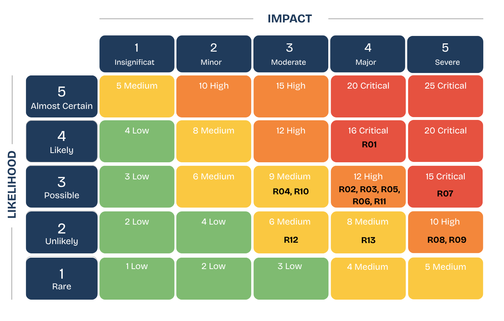

# Risk Register

Status: Working baseline

Risk score equals likelihood multiplied by impact.

| Score | Priority |
|---:|---|
| 1 to 4 | Low |
| 5 to 9 | Medium |
| 10 to 14 | High |
| 15 to 25 | Critical |

## Risks

| ID | Category | Risk | L | I | Score | Preventive action | Contingency action | Owner |
|---|---|---|---:|---:|---:|---|---|---|
| R01 | Scope and schedule | The V1 scope exceeds the capacity of a three-member team | 4 | 4 | 16 Critical | Prioritise the core student journey, estimate work, monitor velocity, and reject unapproved scope | Defer the lowest-value supporting feature and record the change | Jerald and all members |
| R02 | Team delivery | Assigned work is completed later than agreed internal dates | 3 | 4 | 12 High | Use named owners, due dates, GitHub issues, meeting actions, and weekly checks | Reallocate work, reduce non-core tasks, and update planning records | Team Leader and all members |
| R03 | Requirements | Scope or requirements change after dependent work starts | 3 | 4 | 12 High | Record effort, risk, quality, and schedule effects before approval | Move the change to future scope or replace a similar item | Jerald and all members |
| R04 | Technical capability | The team needs more time to learn the selected stack | 3 | 3 | 9 Medium | Build small prototypes, maintain setup guides, pair on difficult tasks, and keep the stack stable | Simplify implementation and assign difficult work to the strongest available member | Technical leads and Jerald |
| R05 | Integration | React, Django, PostgreSQL, authentication, or AI services fail to integrate | 3 | 4 | 12 High | Build an early end-to-end flow, agree API formats, and integrate continuously | Use mocked AI responses and isolate the failing service | Jerald and Md Enamul |
| R06 | Data quality | Career, skill, qualification, or learning data is incomplete or inconsistent | 3 | 4 | 12 High | Record sources, review dates, owners, and correction processes | Remove unreliable records, correct data, and rerun tests | All members |
| R07 | AI output quality | Generated content contains unsupported or misleading guidance | 3 | 5 | 15 Critical | Use approved prompts, data minimisation, validation, limitations, editable drafts, and user review | Block invalid output, show a safe error, and use approved fallback text | Md Enamul and all members |
| R08 | Fairness and explainability | Scoring produces biased, inconsistent, or unclear results | 2 | 5 | 10 High | Use documented rules, exclude protected attributes, show factors, and test equivalent profiles | Adjust approved weights, record the reason, and rerun tests | All members |
| R09 | Security and privacy | Personal data, credentials, or another student's records are exposed | 2 | 5 | 10 High | Apply authentication, role access, ownership checks, data minimisation, backend secrets, and permission tests | Disable the affected function, rotate secrets, correct permissions, and record the incident | Md Enamul |
| R10 | Third-party services | OpenAI, Railway, Vercel, GitHub, or another service becomes unavailable or exceeds limits | 3 | 3 | 9 Medium | Monitor usage, set limits, use health checks, and retain saved test responses | Use mocked output, a local environment, or the last stable deployment | Jerald and Md Enamul |
| R11 | Testing and deployment | Testing begins late, critical defects stay open, or deployment fails | 3 | 4 | 12 High | Test during every Sprint, define acceptance criteria early, deploy before finalisation, and run regression tests | Stop new feature work and use the last stable deployed or local build | Jerald and all members |
| R12 | User acceptance testing | Too few students participate in acceptance testing | 2 | 3 | 6 Medium | Recruit early, prepare short tasks, and schedule testing before finalisation | Use additional team-based checks and state the participant limitation | Joyee and all members |
| R13 | Evidence and final delivery | Meeting records, contribution evidence, test results, reports, or presentation work is incomplete | 2 | 4 | 8 Medium | Maintain GitHub history, minutes, test evidence, versions, and weekly evidence checks | Reconstruct records from version history and prioritise assessment evidence | Jerald and all members |

## Review schedule

- Weekly planning meeting
- Sprint planning
- During development after a risk event or blocker
- Sprint review
- Before deployment
- Finalisation review

High and Critical risks must appear on the weekly meeting agenda.
