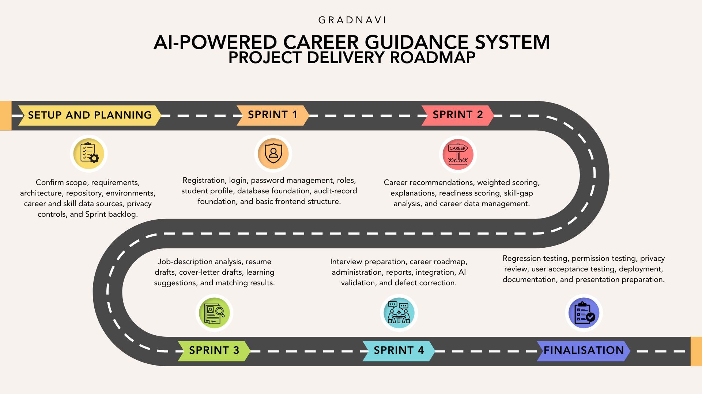

# Roadmap and Milestones

Status: Working delivery baseline

## Delivery approach

GradNavi will use Scrum with four two-week Sprints. Each Sprint ends with an integrated review. The finalisation period protects testing, deployment, documentation, and presentation work.

## Schedule

| Phase | Dates | Main work | Exit milestone |
|---|---|---|---|
| Setup and planning | Up to 9 August 2026 | Confirm scope and requirements, create the repository and backlog, approve architecture, prepare environments, identify data sources, and define privacy controls | Planning baseline approved |
| Sprint 1: Secure foundation | 10 to 23 August 2026 | Registration, login, password management, JWT access, roles, database foundation, student profile, responsive frontend shell, audit foundation, and first end-to-end flow | Authenticated student-profile flow demonstrated |
| Sprint 2: Career analysis | 24 August to 6 September 2026 | Career and skill data, recommendation scoring, ranked results, readiness scores, skill gaps, explanations, and career-data administration | Career-analysis flow demonstrated |
| Sprint 3: Application preparation | 7 to 20 September 2026 | Job-description matching, resume drafts, cover-letter drafts, learning suggestions, and first career-roadmap increment | Employment-preparation flow demonstrated |
| Sprint 4: Completion and hardening | 21 September to 4 October 2026 | Interview preparation, roadmap completion, dashboards, administration, analytics, AI validation, integration, and defect correction | Planned feature development completed |
| Finalisation | 5 to 11 October 2026 | Regression, security, privacy, usability, acceptance, deployment, recovery checks, report, presentation, and rehearsal | Release and assessment evidence accepted |
| Final report | 12 October 2026, 12:00 am AEST | Submit the comprehensive group final report | Assessment 3 submitted |
| Final presentation | 12 October 2026, 9:00 am AEST | Deliver the presentation and individual component | Assessment 4 completed |

## Major dependencies

| Dependency | Required before |
|---|---|
| Approved requirements | Final backlog and Sprint commitment |
| WBS and estimates | Final Microsoft Project schedule |
| Architecture decisions | Frontend and backend implementation |
| Database entities | Profile, career, skill, recommendation, and audit development |
| Career and skill data | Recommendation and gap-analysis testing |
| Authentication and permissions | Protected student and administrator flows |
| AI prompts and validation | Explanations and generated documents |
| Integrated build | System, usability, acceptance, and deployment testing |

## Schedule review

The team will review dates, workload, blockers, dependencies, and scope during each weekly meeting and Sprint review.
