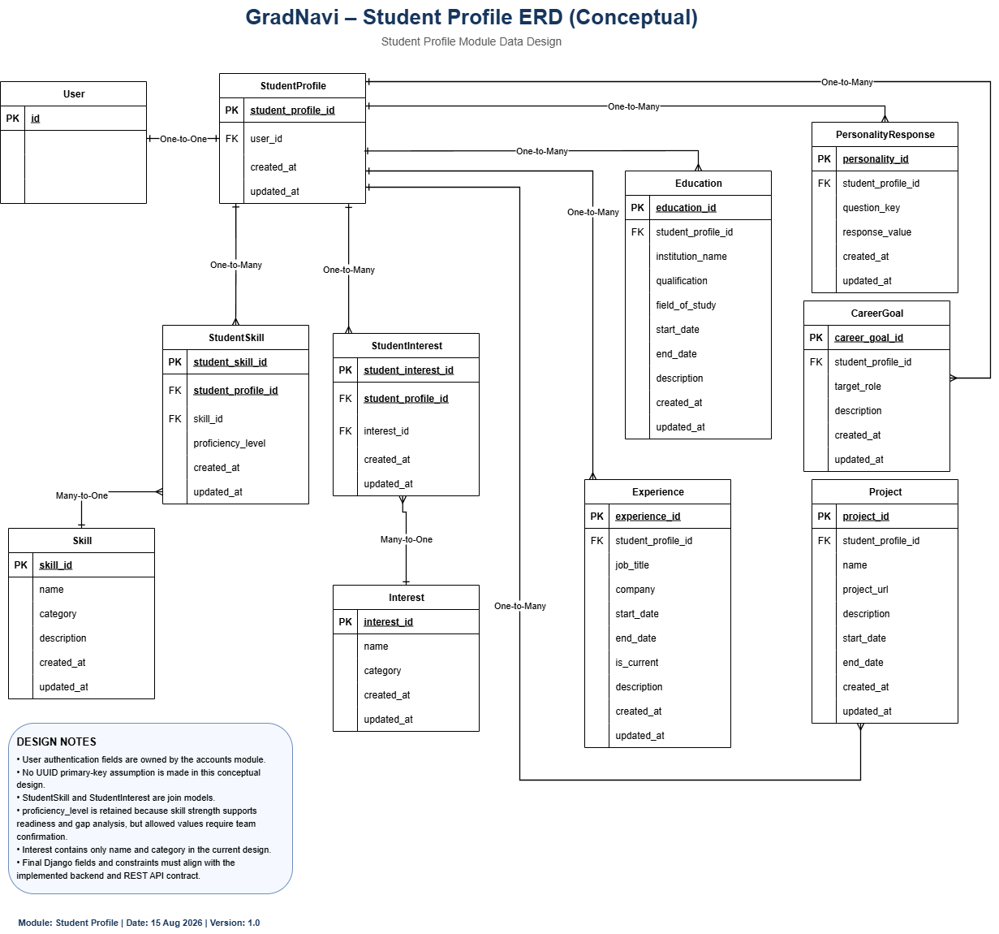

# GradNavi Student Profile API and Model Mapping

Status: Working design for team review

## 1. Purpose

This document maps the GradNavi Student Profile REST API contract to the planned Student Profile data model.

The mapping provides a shared reference for backend, frontend, integration, and testing work by showing how API fields relate to conceptual entities and student-owned database records.

This document does not replace the GradNavi REST API Design or the Student Profile Data Design. It connects those two design artifacts.

The mapping should remain aligned with:

- `docs/system-design/rest-api-design.md`
- `docs/system-design/student-profile-data-design.md`
- `docs/system-design/security-architecture.md`
- The implemented authentication model.
- The implemented Django Student Profile models and serializers.

## 2. Existing Student Profile ERD

A second ERD is not required for this mapping document because the Student Profile entities and relationships are already documented in the Student Profile Data Design.

The existing ERD should remain the visual source for the Student Profile data structure:

The editable Draw.io source is stored at:

`docs/system-design/images/gradnavi-student-profile-erd.drawio`

This mapping document focuses on how the REST API reads from and writes to those entities.

## 3. Mapping Overview

The Student Profile API provides an aggregated view of the authenticated student's profile.

The current high-level flow is:

    React Frontend
          |
          | GET /api/v1/profile/
          | PATCH /api/v1/profile/
          v
    Django REST API
          |
          | Authenticated User
          v
    StudentProfile
          |
          +---- Education
          +---- Experience
          +---- Project
          +---- CareerGoal
          +---- PersonalityResponse
          +---- StudentSkill ---- Skill
          +---- StudentInterest ---- Interest

The Django backend is responsible for converting the related Student Profile records into the JSON structure used by the React frontend.

## 4. Student Profile API Endpoints

The current Sprint 1 REST API contract defines two Student Profile endpoints.

| HTTP Method | Endpoint | Purpose |
| --- | --- | --- |
| `GET` | `/api/v1/profile/` | Retrieve the authenticated student's Student Profile |
| `PATCH` | `/api/v1/profile/` | Update selected Student Profile information |

Both endpoints require authentication.

The backend must identify the Student Profile through the authenticated User rather than a client-provided `user_id` or `student_profile_id`.

## 5. GET Profile Mapping

The current REST API contract represents the Student Profile using an aggregated JSON structure.

Conceptual response:

    {
      "data": {
        "profile": {
          "skills": [],
          "interests": [],
          "education": [],
          "experience": [],
          "projects": [],
          "career_goals": [],
          "personality_responses": []
        }
      }
    }

Each collection maps to one or more Student Profile entities.

| API Field | Conceptual Entity or Relationship | Ownership |
| --- | --- | --- |
| `skills` | `StudentSkill` joined with `Skill` | Student-owned relationship with shared Skill data |
| `interests` | `StudentInterest` joined with `Interest` | Student-owned relationship with shared Interest data |
| `education` | `Education` | Student-owned |
| `experience` | `Experience` | Student-owned |
| `projects` | `Project` | Student-owned |
| `career_goals` | `CareerGoal` | Student-owned |
| `personality_responses` | `PersonalityResponse` | Student-owned |

The API response should only include records associated with the authenticated student's StudentProfile.

## 6. PATCH Profile Mapping

The `PATCH /api/v1/profile/` endpoint supports partial Student Profile updates.

A PATCH request should update only the fields included in the request and should not require unrelated profile information to be resubmitted.

Conceptual example:

    {
      "career_goals": [
        "Software Engineer"
      ],
      "interests": [
        "Artificial Intelligence",
        "Backend Development"
      ]
    }

The exact writable JSON structure should be confirmed against the implemented serializers before the Student Profile backend module is finalised.

The backend must validate each supplied collection and apply changes only to the authenticated student's Student Profile.

## 7. StudentProfile Model Mapping

The `StudentProfile` model acts as the parent record for student-owned profile information.

| Conceptual Field | API Exposure | Notes |
| --- | --- | --- |
| `id` | Normally internal | Should not be trusted from frontend input for ownership |
| `user_id` | Internal relationship | Derived from authenticated User |
| `created_at` | Optional response metadata | Not required in the current high-level profile contract |
| `updated_at` | Optional response metadata | May support future profile update tracking |

The frontend should not select profile ownership by sending a `user_id`.

## 8. Skill Mapping

Skills use the `StudentSkill` join entity and shared `Skill` reference data.

### 8.1 Model Relationship

    StudentProfile 1 ----- * StudentSkill * ----- 1 Skill

### 8.2 Planned Mapping

| API Concept | Model Field or Entity |
| --- | --- |
| Skill identifier | `Skill.id` |
| Skill name | `Skill.name` |
| Skill category | `Skill.category` |
| Skill description | `Skill.description` |
| Student proficiency | `StudentSkill.proficiency_level` |

The final API representation for a skill should support more than a plain string if proficiency information is required by readiness and skill-gap calculations.

A future structured representation may look like:

    {
      "id": 12,
      "name": "Python",
      "category": "Programming",
      "proficiency_level": "Intermediate"
    }

This structure is conceptual until the backend implementation and scoring requirements confirm the final fields.

## 9. Interest Mapping

Interests use the `StudentInterest` join entity and shared `Interest` reference data.

### 9.1 Model Relationship

    StudentProfile 1 ----- * StudentInterest * ----- 1 Interest

### 9.2 Planned Mapping

| API Concept | Model Field or Entity |
| --- | --- |
| Interest identifier | `Interest.id` |
| Interest name | `Interest.name` |
| Interest category | `Interest.category` |

Student-facing profile operations should manage the relationship between the authenticated StudentProfile and shared Interest records.

They should not automatically grant permission to edit shared Interest reference data.

## 10. Education Mapping

Each Education API item maps to one `Education` record.

| API Concept | Planned Model Field |
| --- | --- |
| Education identifier | `Education.id` |
| Institution | `Education.institution_name` |
| Qualification | `Education.qualification` |
| Field of study | `Education.field_of_study` |
| Start date | `Education.start_date` |
| End date | `Education.end_date` |
| Description | `Education.description` |

The backend should associate Education records with the authenticated StudentProfile.

## 11. Experience Mapping

Each Experience API item maps to one `Experience` record.

| API Concept | Planned Model Field |
| --- | --- |
| Experience identifier | `Experience.id` |
| Job title | `Experience.job_title` |
| Company | `Experience.company` |
| Start date | `Experience.start_date` |
| End date | `Experience.end_date` |
| Current role | `Experience.is_current` |
| Description | `Experience.description` |

The final serializer should enforce consistent behaviour between `is_current` and `end_date`.

## 12. Project Mapping

Each Project API item maps to one `Project` record.

| API Concept | Planned Model Field |
| --- | --- |
| Project identifier | `Project.id` |
| Project name | `Project.name` |
| Description | `Project.description` |
| Project URL | `Project.project_url` |
| Start date | `Project.start_date` |
| End date | `Project.end_date` |

The current design does not include a structured Project-to-Skill relationship.

If one is introduced later, both the Student Profile Data Design and this mapping document should be updated.

## 13. Career Goal Mapping

Each career-goal API item maps to one `CareerGoal` record.

| API Concept | Planned Model Field |
| --- | --- |
| Career goal identifier | `CareerGoal.id` |
| Target role | `CareerGoal.target_role` |
| Description | `CareerGoal.description` |

Career goals may later provide input to recommendation, readiness, skill-gap, learning-resource, and roadmap functions.

The scoring behaviour is outside the scope of this mapping document.

## 14. Personality Response Mapping

Each personality-response API item maps to one `PersonalityResponse` record.

| API Concept | Planned Model Field |
| --- | --- |
| Response identifier | `PersonalityResponse.id` |
| Question identifier | `PersonalityResponse.question_key` |
| Response value | `PersonalityResponse.response_value` |

The final personality questionnaire and permitted values remain an open design decision.

This mapping only defines how approved responses would connect to the Student Profile model.

## 15. Ownership Mapping

The following entities contain student-owned information:

- `StudentProfile`
- `StudentSkill`
- `StudentInterest`
- `Education`
- `Experience`
- `Project`
- `CareerGoal`
- `PersonalityResponse`

Ownership should follow this backend path:

    JWT
     |
     v
    Authenticated User
     |
     v
    StudentProfile
     |
     v
    Related Student-Owned Records

The backend should not use a client-submitted user identifier as proof of ownership.

Shared reference entities such as `Skill` and `Interest` require separate permission rules.

## 16. Validation Mapping

API validation should be applied before Student Profile changes are stored.

| Validation Area | Model or API Concern |
| --- | --- |
| Authentication | Valid JWT required |
| Ownership | Authenticated User must own StudentProfile |
| Skill reference | Referenced Skill must exist |
| Interest reference | Referenced Interest must exist |
| Proficiency | Must use an approved value once the scale is confirmed |
| Duplicate skills | Prevent duplicate StudentSkill relationships where appropriate |
| Duplicate interests | Prevent duplicate StudentInterest relationships where appropriate |
| Dates | Validate format and logical ranges |
| URLs | Validate project URL format |
| Required fields | Enforce serializer and model requirements |
| Permissions | Reject unauthorised Student or Administrator operations |

Validation errors should follow the standard error-response format defined by the GradNavi REST API Design.

## 17. HTTP Status Mapping

The Student Profile API should use the status-code conventions defined by the shared REST API design.

| Status | Student Profile Use |
| --- | --- |
| `200 OK` | Successful profile retrieval or update |
| `400 Bad Request` | Invalid Student Profile input |
| `401 Unauthorized` | Authentication missing, invalid, or expired |
| `403 Forbidden` | Authenticated user lacks permission |
| `404 Not Found` | Required profile or related resource does not exist |
| `500 Internal Server Error` | Unexpected backend failure |

The exact behaviour should remain consistent with the implemented exception handler and backend serializers.

## 18. Frontend Mapping

The React frontend should consume Student Profile information through the REST API rather than storing database-specific knowledge.

The frontend should understand API fields such as:

- `skills`
- `interests`
- `education`
- `experience`
- `projects`
- `career_goals`
- `personality_responses`

The frontend should not need to understand:

- PostgreSQL table names.
- Django migration details.
- Database foreign-key implementation.
- Database credentials.
- Backend ownership-query logic.

This separation keeps the REST API as the contract between frontend and backend.

## 19. Serializer Responsibility

Django REST Framework serializers should provide the translation between API JSON and Student Profile model data.

Serializer responsibilities may include:

- Converting model records into JSON.
- Validating incoming profile data.
- Applying approved field rules.
- Supporting partial updates.
- Preventing writable access to server-controlled fields.
- Coordinating nested or related Student Profile data where required.

The final serializer structure should be selected by the backend developer based on the approved API contract and data model.

## 20. Current Contract Gap

The current Sprint 1 REST API contract defines the overall `GET /api/v1/profile/` and `PATCH /api/v1/profile/` operations but does not yet define detailed CRUD endpoints for each related entity.

For example, separate endpoints are not yet confirmed for:

- Education.
- Experience.
- Projects.
- Student skills.
- Student interests.
- Career goals.
- Personality responses.

This is not treated as an implementation decision in this document.

The team should decide whether related records will be managed:

1. Through nested profile requests.
2. Through dedicated resource endpoints.
3. Through a combination of both approaches.

The chosen approach should be documented in the REST API Design before frontend and backend integration depends on it.

## 21. Open Mapping Decisions

The following items require team or backend confirmation:

1. Final JSON structure for each Skill item.
2. Final JSON structure for each Interest item.
3. Whether `proficiency_level` is exposed and writable through the profile API.
4. Final proficiency scale.
5. Whether related entities use nested profile updates or dedicated endpoints.
6. Whether StudentProfile is automatically created during registration.
7. Whether `created_at` and `updated_at` values are exposed to the frontend.
8. Whether shared Skills and Interests are read-only for Student users.
9. How deleted related records are handled through PATCH requests.
10. How current Education, Experience, and Project records represent missing end dates.
11. Final personality-response structure.
12. Final serializer nesting strategy.

These decisions should be resolved before the Student Profile backend and frontend integration is considered complete.

## 22. Implementation Review Checklist

Before the Student Profile API is considered aligned with this design, the team should verify:

- The authenticated User maps to one StudentProfile.
- Student-owned records are restricted to the authenticated Student.
- Skill relationships use StudentSkill.
- Interest relationships use StudentInterest.
- GET profile responses match the approved API structure.
- PATCH behaviour does not unintentionally replace unrelated profile information.
- Server-controlled fields are not writable by normal Student requests.
- Validation follows the REST API conventions.
- Permission failures use the correct status codes.
- The frontend does not require direct database knowledge.
- The model implementation matches the Student Profile ERD.
- API changes are reflected in the REST API Design.

## 23. Design Status

This document is a working mapping artifact for Sprint 1 team review.

It connects the Student Profile REST API contract to the conceptual Student Profile data design.

Final field names, serializer behaviour, nested update behaviour, and related-resource endpoints should be confirmed against the implemented backend before this mapping is treated as final.

Any material API or model change should be reflected in:

- `rest-api-design.md`
- `student-profile-data-design.md`
- This mapping document.
- The Student Profile ERD where relationships change.
